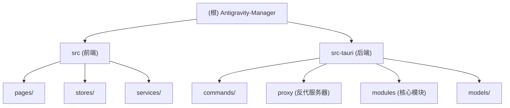

# CLAUDE.md

This file provides guidance to Claude Code (claude.ai/code) when working with code in this repository.

## 变更记录 (Changelog)
- 2026-02-04: 执行架构初始化，生成模块级文档并更新根级架构图。

## 项目愿景
Antigravity Tools 是一个基于 Tauri v2 开发的桌面应用程序，提供 Gemini 和 Claude AI 账号管理以及本地 API 反代服务。

## 架构总览

### 模块结构图

### 模块索引
| 模块 | 路径 | 职责 |
| :--- | :--- | :--- |
| **前端** | `src/` | React 界面、状态管理、IPC 通信调用 |
| **后端** | `src-tauri/` | Rust 核心逻辑、Axum 反代服务、SQLite 存储 |
| **工作流** | `.github/` | GitHub Actions 自动化发布流程 |

## 技术栈
**前端**: React 19, TypeScript, Router v7, Zustand, TailwindCSS, DaisyUI.
**后端**: Tauri v2, Rust, Axum, SQLite (Rusqlite), Reqwest, Tokio.

## 开发命令
详见各模块 `CLAUDE.md` 或原 `README.md`。
- 启动开发: `npm run tauri dev`
- 构建项目: `npm run tauri build`

## 编码规范
- **原则**: 严格遵循 SOLID, KISS, DRY, YAGNI。
- **语言**: 代码注释使用中文。
- **AI 指引**: 优先阅读项目内的 `CLAUDE.md` 获取上下文。

---
*上次扫描时间: 2026-02-04 11:52:14*
*扫描覆盖率: 100%*
