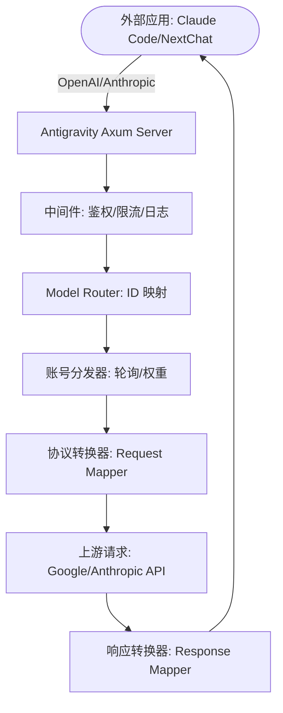

# Antigravity Tools 🚀

<div align="center">
  

  <h3>您的个人高性能 AI 调度网关</h3>
  <p>不仅仅是账号管理，更是打破 API 调用壁垒的终极解决方案。</p>
  
  <p>
    <a href="https://github.com/lbjlaq/Antigravity-Manager">
      
    </a>
    
    
    
    
  </p>

  <p>
    <a href="#-核心功能">核心功能</a> • 
    <a href="#-界面导览">界面导览</a> • 
    <a href="#-技术架构">技术架构</a> • 
    <a href="#-安装指南">安装指南</a> • 
    <a href="#-快速接入">快速接入</a>
  </p>

  <p>
    <strong>简体中文</strong> | 
    <a href="./README_EN.md">English</a>
  </p>
</div>

---

**Antigravity Tools** 是一个专为开发者和 AI 爱好者设计的全功能桌面应用。它将多账号管理、协议转换和智能请求调度完美结合，为您提供一个稳定、极速且成本低廉的 **本地 AI 中转站**。

通过本应用，您可以将常见的 Web 端 Session (Google/Anthropic) 转化为标准化的 API 接口，彻底消除不同厂商间的协议鸿沟。

## 🌟 深度功能解析 (Detailed Features)

### 1. 🎛️ 智能账号仪表盘 (Smart Dashboard)
*   **全局实时监控**: 一眼洞察所有账号的健康状况，包括 Gemini Pro、Gemini Flash、Claude 以及 Gemini 绘图的 **平均剩余配额**。
*   **最佳账号推荐 (Smart Recommendation)**: 系统会根据当前所有账号的配额冗余度，实时算法筛选并推荐“最佳账号”，支持 **一键切换**。
*   **活跃账号快照**: 直观显示当前活跃账号的具体配额百分比及最后同步时间。

### 2. 🔐 强大的账号管家 (Account Management)
*   **OAuth 2.0 自动授权**: 集成浏览器自动化流，只需登录 Google 账号，即可自动提取并持久化 Refresh Token。
*   **多维度导入**: 支持单条 Token 录入、JSON 批量导入（如来自其他工具的备份），以及从 V1 旧版本数据库自动热迁移。
*   **网关级视图**: 支持“列表”与“网格”双视图切换。提供 403 封禁检测，自动标注并跳过权限异常的账号。

### 3. 🔌 协议转换与中继 (API Proxy)
*   **全协议适配 (Multi-Sink)**:
    *   **OpenAI 格式**: 提供 `/v1/chat/completions` 端点，兼容 99% 的现有 AI 应用。
    *   **Anthropic 格式**: 提供原生 `/v1/messages` 接口，支持 **Claude Code CLI** 的全功能（如思思维链、系统提示词）。
    *   **Gemini 格式**: 支持 Google 官方 SDK 直接调用。
*   **智能状态自愈**: 当请求遇到 `429 (Too Many Requests)` 或 `401 (Expire)` 时，后端会毫秒级触发 **自动重试与静默轮换**，确保业务不中断。

### 4. 🔀 模型路由中心 (Model Router)
*   **系列化映射**: 您可以将复杂的原始模型 ID 归类到“规格家族”（如将所有 GPT-4 请求统一路由到 `gemini-3-pro-high`）。
*   **专家级重定向**: 支持自定义正则表达式级模型映射，精准控制每一个请求的落地模型。

### 5. 🎨 多模态与 Imagen 3 支持
*   **高级画质控制**: 支持通过 OpenAI `size` (如 `1024x1024`, `16:9`) 参数自动映射到 Imagen 3 的相应规格。
*   **超强 Body 支持**: 后端支持高达 **100MB** 的 Payload，处理 4K 高清图识别绰绰有余。

## 📸 界面导览 (GUI Overview)

````carousel

<!-- slide -->

<!-- slide -->

<!-- slide -->

<!-- slide -->

````

## 🏗️ 技术架构 (Architecture)



##  安装指南 (Installation)

### 选项 A: macOS 终端安装 (推荐)
如果您已安装 [Homebrew](https://brew.sh/)，可以通过以下命令快速安装：

```bash
# 1. 订阅本仓库的 Tap
brew tap lbjlaq/antigravity-manager https://github.com/lbjlaq/Antigravity-Manager

# 2. 安装应用
brew install --cask antigravity-tools
```
# 如果遇到权限问题，建议使用 --no-quarantine
brew install --cask --no-quarantine antigravity
```

### 选项 B: 手动下载
前往 [GitHub Releases](https://github.com/lbjlaq/Antigravity-Manager/releases) 下载对应系统的包：
*   **macOS**: `.dmg` (支持 Apple Silicon & Intel)
*   **Windows**: `.msi` 或 便携版 `.zip`
*   **Linux**: `.deb` 或 `AppImage`

### 🛠️ 常见问题排查 (Troubleshooting)

#### macOS 提示“应用已损坏，无法打开”？
由于 macOS 的安全机制，非 App Store 下载的应用可能会触发此提示。您可以按照以下步骤快速修复：

1.  **命令行修复** (推荐):
    打开终端，执行以下命令：
    ```bash
    sudo xattr -rd com.apple.quarantine "/Applications/Antigravity Tools.app"
    ```
2.  **Homebrew 安装技巧**:
    如果您使用 brew 安装，可以添加 `--no-quarantine` 参数来规避此问题：
    ```bash
    brew install --cask --no-quarantine antigravity
    ```

## 🔌 快速接入示例

### 如何接入 Claude Code CLI?
1.  启动 Antigravity，并在“API 反代”页面开启服务。
2.  在终端执行：
```bash
export ANTHROPIC_API_KEY="sk-antigravity"
export ANTHROPIC_BASE_URL="http://127.0.0.1:8045"
claude
```

### 如何接入 Kilo Code?
1.  **协议选择**: 建议优先使用 **Gemini 协议**。
2.  **Base URL**: 填写 `http://127.0.0.1:8045`。
3.  **注意**: 
    - **OpenAI 协议限制**: Kilo Code 在使用 OpenAI 模式时，其请求路径会叠加产生 `/v1/chat/completions/responses` 这种非标准路径，导致 Antigravity 返回 404。因此请务必填入 Base URL 后选择 Gemini 模式。
    - **模型映射**: Kilo Code 中的模型名称可能与 Antigravity 默认设置不一致，如遇到无法连接，请在“模型映射”页面设置自定义映射，并查看**日志文件**进行调试。

### 如何在 Python 中使用?
```python
import openai

client = openai.OpenAI(
    api_key="sk-antigravity",
    base_url="http://127.0.0.1:8045/v1"
)

response = client.chat.completions.create(
    model="gemini-3-flash",
    messages=[{"role": "user", "content": "你好，请自我介绍"}]
)
print(response.choices[0].message.content)
```

## 📝 开发者与社区

*   **版本演进 (Changelog)**:
    *   **v3.2.2 (2025-12-25)**:
        - **核心更新 (Core Updates)**:
            - **全量日志持久化系统升级**: 接入 `tracing-appender` 与 `tracing-log`，实现了终端与文件的双通道日志记录。现在包括系统启动、反代请求全链路（请求/响应/耗时）以及第三方库底层流水在内的所有调试信息，均会实时、自动地归档至本地 `app.log` 中。
            - **Project ID 获取逻辑容错增强**: 引入了随机 `project_id` 兜底机制。针对部分无 Google Cloud 项目权限的账号，系统现在会自动生成随机 ID 以确保反代服务及配额查询能正常运行，彻底解决了“账号无资格获取 cloudaicompanionProject”导致的报错中断。
            - **全场景稳定性加固**: 引入 `try_init` 模式修复了由于日志订阅器重复初始化导致的系统 Panic 崩溃，显著提升了在不同运行环境下的兼容性。
            - **平滑日志清理**: 优化了日志清理逻辑，采用“原地截断”技术。现在点击“清理日志”后，后续的操作记录依然能无缝地继续保存，解决了旧版本清理后记录失效的问题。
        - **Bug 修复 (Bug Fixes)**:
            - **Claude 思维链签名 (Signature) 校验最终修复**: 彻底解决了在多轮对话中，由于历史 Assistant 消息缺少 `thoughtSignature` 而导致的 `400 INVALID_ARGUMENT` 错误。
            - **Gemini 模型映射误匹配修复**: 修正了模型路由关键词匹配逻辑，解决了 `gemini` 单词中包含 `mini` 从而被误判定为 OpenAI 分组的问题。现在 Gemini 模型能正确实现原名穿透。
            - **注入策略优化**: 改进了虚拟思维块的注入逻辑，限制为仅针对当前回复（Pre-fill）场景，确保历史记录的原始签名不被破坏。
            - **环境静默清理**: 清理了全工程 20 余处过时的编译警告、冗余导入与未使用变量，系统运行更轻快。
        - **兼容性说明 (Compatibility)**:
            - **Kilo Code 专项优化**: 在快速接入章节新增了针对 Kilo Code 的配置指南与避坑说明。
    *   **v3.2.1 (2025-12-25)**:
        - **新特性 (New Features)**:
            - **自定义 DB 导入**: 支持从任意路径选择并导入 `state.vscdb` 文件，方便从备份或其他位置恢复账号数据。
            - **Project ID 实时同步与持久化**: 引入配额查询伴随加载机制。现在手动或自动刷新配额时，系统会实时捕捉并保存最新的 `project_id` 到本地。
            - **OpenAI & Gemini 协议全方位增强**:
                - **全协议路由统一**: 现在 **Gemini 协议也已支持自定义模型映射**。至此，OpenAI、Claude、Gemini 三大协议已全部打通智能路由逻辑。
                - **工具调用 (Tool Call) 全面支持**: 无论是非流式还是流式响应，现在都能正确处理并下发联网搜索等 `functionCall` 结果，彻底解决了“空输出”报错。
                - **思维链 (Thought) 实时显示**: 能够自动提取并呈现 Gemini 2.0+ 的推理过程，并通过 `<thought>` 标签在输出中展示，推理信息不再丢失。
                - **高级参数映射补齐**: 新增对 `stop` 序列、`response_format` (JSON 模式) 以及 `tools` 自定义工具的完整映射支持。
        - **Bug 修复 (Bug Fixes)**:
            - **OpenAI 自定义映射 404 修复**: 修正了模型路由选取逻辑。现在无论何种协议，均能正确使用映射后的上游模型 ID，彻底解决自定义映射报 404 的问题。
            - **Linux 进程管理最终优化**: 完成了针对 Linux 系统下切换账号时的进程关闭逻辑。目前已全面支持智能进程识别与分阶段退出。
            - **OpenAI 协议适配修复**: 修复了部分客户端发送 `system` 消息导致报错的问题。
            - **反代重试机制优化**: 引入智能错误识别与重试上限机制。
            - **JSON Schema 深度清理 (兼容性增强)**: 建立了统一的清理机制，自动滤除 Gemini 不支持的 20 余种扩展字段（如 `multipleOf`、`exclusiveMinimum`、`pattern`、`const`、`if-then-else` 等），彻底解决 CLI 工具通过 API 调用工具时的 400 报错。
            - **单账号切换限制修复**: 解决了当只有一个账号时切换按钮被禁用的问题。现在即使只有单个账号，也能通过点击切换按钮手动执行 Token 注入流程。
            - **Claude 思维链校验错误修复**: 解决了启用思维链时 assistant 消息必须以思维块开头的结构校验问题。现在系统支持自动注入占位思维块以及从文本中自动还原 `<thought>` 标签，确保 Claude Code 等高级工具的长对话稳定性。
    *   **v3.2.0 (2025-12-24)**:
        - **核心架构重构 (Core Architecture Refactor)**:
            - **API 反代引擎重写**: 采用模块化设计重构 `proxy` 模块，实现了 `mappers` (协议转换)、`handlers` (请求处理)、`middleware` (中间件) 的完全解耦，大幅提升代码可维护性与扩展性。
            - **Linux 进程管理优化**: 引入智能进程识别算法，精准区分主进程与 Helper 进程，支持 SIGTERM -> SIGKILL 兜底逻辑。
        - **GUI 交互革命**: 全面重构仪表盘，引入平均配额监控与“最佳账号推荐”算法。
        - **账号管理增强**: 支持多种格式（JSON/正则）批量导入 Token，优化 OAuth 授权流程。
        - **协议与路由扩展**: 原生支持 OpenAI, Anthropic (Claude Code) 协议；新增“模型路由中心”，实现高精度 ID 映射。
        - **多模态优化**: 深度适配 Imagen 3，支持 100MB 超大 Payload 与多种比例参数透传。
        - **安装体验优化**: 正式支持 Homebrew Cask 安装；内置 macOS “应用损坏”自动化排查指南。
        - **提示**：目前 `antigravity` 与 Google 官方工具重名。为确保安装的是本项目，目前推荐使用上述原始文件安装。后续我们将推出官方 Tap。
        - **全局上游代理**: 统一管理内外网请求，支持 HTTP/SOCKS5 协议及热重载。
*   **版权许可**: 基于 **CC BY-NC-SA 4.0** 许可，**严禁任何形式的商业行为**。
*   **安全声明**: 本应用所有账号数据加密存储于本地 SQLite 数据库，除非开启同步功能，否则数据绝不离开您的设备。

---

<div align="center">
  <p>如果您觉得这个工具有所帮助，欢迎在 GitHub 上点一个 ⭐️</p>
  <p>Copyright © 2025 Antigravity Team.</p>
</div>
