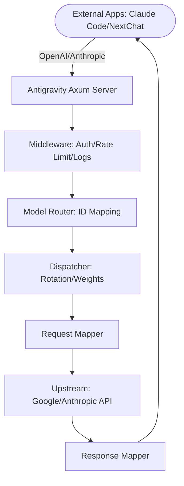

# Antigravity Tools 🚀

<div align="center">
  

  <h3>Your Personal High-Performance AI Dispatch Gateway</h3>
  <p>Seamlessly proxy Gemini & Claude. OpenAI-Compatible. Privacy First.</p>
  
  <p>
    <a href="https://github.com/lbjlaq/Antigravity-Manager">
      
    </a>
    
    
    
    
  </p>

  <p>
    <a href="#-features">Features</a> • 
    <a href="#-gui-overview">GUI Overview</a> • 
    <a href="#-architecture">Architecture</a> • 
    <a href="#-installation">Installation</a> • 
    <a href="#-quick-integration">Integration</a>
  </p>

  <p>
    <a href="./README.md">简体中文</a> | 
    <strong>English</strong>
  </p>
</div>

---

**Antigravity Tools** is an all-in-one desktop application designed for developers and AI enthusiasts. It perfectly combines multi-account management, protocol conversion, and smart request scheduling to provide you with a stable, high-speed, and low-cost **Local AI Relay Station**.

By leveraging this app, you can transform common Web Sessions (Google/Anthropic) into standardized API interfaces, completely eliminating the protocol gap between different providers.

## 🌟 Detailed Feature Matrix

### 1. 🎛️ Smart Account Dashboard
*   **Global Real-time Monitoring**: Instant insight into the health of all accounts, including average remaining quotas for Gemini Pro, Gemini Flash, Claude, and Gemini Image generation.
*   **Smart Recommendation**: The system uses a real-time algorithm to filter and recommend the "Best Account" based on quota redundancy, supporting **one-click switching**.
*   **Active Account Snapshot**: Visually displays the specific quota percentage and the last synchronization time of the currently active account.

### 2. 🔐 Powerful Account Manager
*   **OAuth 2.0 Auto Authorization**: Integrated browser automation flow. Simply log in to your Google account, and the app will automatically extract and persist the Refresh Token.
*   **Multi-dimensional Import**: Supports single token entry, JSON batch import, and automatic hot migration from V1 legacy databases.
*   **Gateway-level Views**: Supports switching between "List" and "Grid" views. Provides 403 Forbidden detection, automatically marking and skipping accounts with permission anomalies.

### 3.  Protocol Conversion & Relay (API Proxy)
*   **Multi-Protocol Adaptation (Multi-Sink)**:
    *   **OpenAI Format**: Provides `/v1/chat/completions` endpoint, compatible with 99% of existing AI apps.
    *   **Anthropic Format**: Provides native `/v1/messages` interface, supporting all features of **Claude Code CLI** (e.g., chain-of-thought, system prompts).
    *   **Gemini Format**: Supports direct calls from official Google AI SDKs.
*   **Smart Self-healing**: When a request encounters `429 (Too Many Requests)` or `401 (Expired)`, the backend triggers **millisecond-level automatic retry and silent rotation**, ensuring business continuity.

### 4. 🔀 Model Router Center
*   **Series-based Mapping**: Classify complex original model IDs into "Series Groups" (e.g., routing all GPT-4 requests uniformly to `gemini-3-pro-high`).
*   **Expert Redirection**: Supports custom regex-level model mapping for precise control over every request's landing model.

### 5. 🎨 Multimodal & Imagen 3 Support
*   **Advanced Image Control**: Supports precise control over image generation tasks via OpenAI `size` (e.g., `1024x1024`, `16:9`) parameters or model name suffixes.
*   **Enhanced Payload Support**: The backend supports payloads up to **100MB**, more than enough for 4K HD image recognition and processing.

##  GUI Overview

````carousel

<!-- slide -->

<!-- slide -->

<!-- slide -->

<!-- slide -->

````

## 🏗️ Architecture



## 📥 Installation

### Option A: macOS Terminal (Recommended)
If you have [Homebrew](https://brew.sh/) installed, run:

```bash
# 1. Tap the repository
brew tap lbjlaq/antigravity-manager https://github.com/lbjlaq/Antigravity-Manager

# 2. Install the app
brew install --cask antigravity-tools
# If you encounter permission issues
brew install --cask --no-quarantine antigravity
```

### Option B: Manual Download
Download from [GitHub Releases](https://github.com/lbjlaq/Antigravity-Manager/releases):
*   **macOS**: `.dmg` (Universal, Apple Silicon & Intel)
*   **Windows**: `.msi` or portable `.zip`
*   **Linux**: `.deb` or `AppImage`

### 🛠️ Troubleshooting

#### macOS says "App is damaged"?
Due to macOS security gatekeeper, non-App Store apps might show this. Run this in Terminal to fix:
```bash
sudo xattr -rd com.apple.quarantine "/Applications/Antigravity Tools.app"
```

## 🔌 Quick Integration Examples

### How to use with Claude Code CLI?
1. Start Antigravity service in the "API Proxy" tab.
2. In your terminal:
```bash
export ANTHROPIC_API_KEY="sk-antigravity"
export ANTHROPIC_BASE_URL="http://127.0.0.1:8045"
claude
```

### How to use in Python?
```python
import openai

client = openai.OpenAI(
    api_key="sk-antigravity",
    base_url="http://127.0.0.1:8045/v1"
)

response = client.chat.completions.create(
    model="gemini-3-flash",
    messages=[{"role": "user", "content": "Hello, please introduce yourself"}]
)
print(response.choices[0].message.content)
```

## 📝 Developer & Community

*   **Changelog**:
    *   **v3.2.1 (2025-12-25)**:
        - **New Features**:
            - **Custom DB Import**: Support importing accounts from any `state.vscdb` file path, facilitating data recovery from backups or custom locations.
            - **Real-time Project ID Sync & Persistence**: Captured and saved the latest `project_id` to the local database in real-time during quota refresh.
            - **OpenAI & Gemini Protocol Reinforcement**:
                - **Unified Model Routing**: Now **Gemini protocol also supports custom model mapping**. This completes the integration of smart routing logic across OpenAI, Anthropic, and Gemini protocols.
                - **Full Tool Call Support**: Correctly handles and delivers `functionCall` results (e.g., search) for both streaming and non-streaming responses, completely resolving the "empty output" error.
                - **Real-time Thought Display**: Automatically extracts and displays Gemini 2.0+ reasoning processes via `<thought>` tags, ensuring no loss of inference information.
                - **Advanced Parameter Mapping**: Added full mapping support for `stop` sequences, `response_format` (JSON mode), and custom `tools`.
        - **Bug Fixes**:
            - **Single Account Switch Restriction Fix**: Resolved the issue where the switch button was hidden when only one account existed. Now, manual Token injection can be triggered for a single account by clicking the switch button.
            - **OpenAI Custom Mapping 404 Fix**: Fixed model routing logic to ensure mapped upstream model IDs are used, resolving 404 errors during custom mapping.
            - **Proxy Retry Logic Optimization**: Introduced smart error recognition and a retry limit. Implemented fail-fast protection for 404 and 429 (quota exhausted).
            - **JSON Schema Deep Cleanup (Compatibility Enhancement)**: Established a unified cleanup mechanism to automatically filter out over 20 extension fields unsupported by Gemini (e.g., `multipleOf`, `exclusiveMinimum`, `pattern`, `const`, `if-then-else`), resolving 400 errors when CLI tools invoke tools via API.
            - **Claude Thinking Chain Validation Fix**: Resolved the structural validation issue where `assistant` messages must start with a thinking block when Thinking is enabled. Now supports automatic injection of placeholder thinking blocks and automatic restoration of `<thought>` tags from text, ensuring stability for long conversations in advanced tools like Claude Code.
            - **OpenAI Adaption Fix**: Resolved issues where some clients sending `system` messages caused errors.
    *   **v3.2.0 (2025-12-24)**:
        - **Core Architecture Refactor**:
            - **Proxy Engine Rewrite**: Completely modularized `proxy` subsystem with decoupled `mappers`, `handlers`, and `middleware` for superior maintainability.
            - **Linux Process Management**: Implemented smart process identification to distinguish Main/Helper processes, ensuring graceful exit via `SIGTERM` with `SIGKILL` fallback.
        - **Homebrew Support**: Official support for macOS one-click installation via `brew install --cask antigravity`.
        - **GUI UX Revolution**: Revamped Dashboard with average quota monitoring and "Best Account Recommendation" algorithm.
        - **Protocol & Router Expansion**: Native support for OpenAI, Anthropic (Claude Code), and Gemini protocols with high-precision Model Router.
        - **Multimodal Optimization**: Deep adaptation for Imagen 3 with 100MB payload capacity and aspect ratio controls.
        - **Global Upstream Proxy**: Centralized request management supporting HTTP/SOCKS5 with hot-reloading.
    *   See [Releases](https://github.com/lbjlaq/Antigravity-Manager/releases) for earlier history.
*   **License**: **CC BY-NC-SA 4.0**. Strictly for non-commercial use.
*   **Security**: All account data is encrypted and stored locally in a SQLite database. Data never leaves your device unless sync is enabled.

---

<div align="center">
  <p>If you find this tool helpful, please give it a ⭐️ on GitHub!</p>
  <p>Copyright © 2025 Antigravity Team.</p>
</div>
